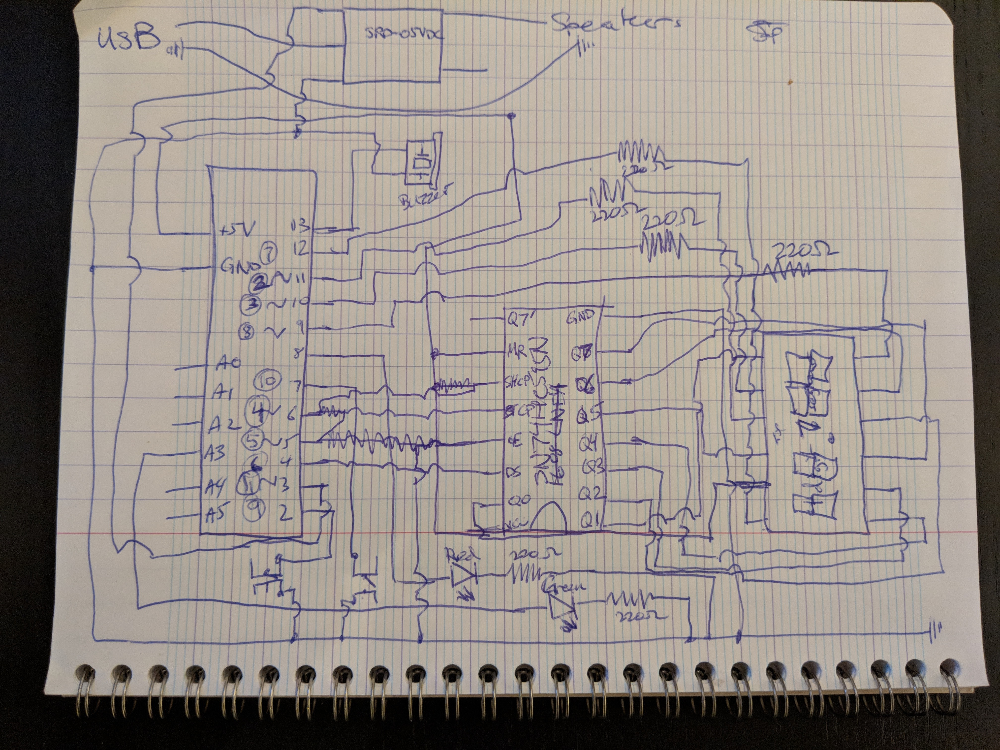
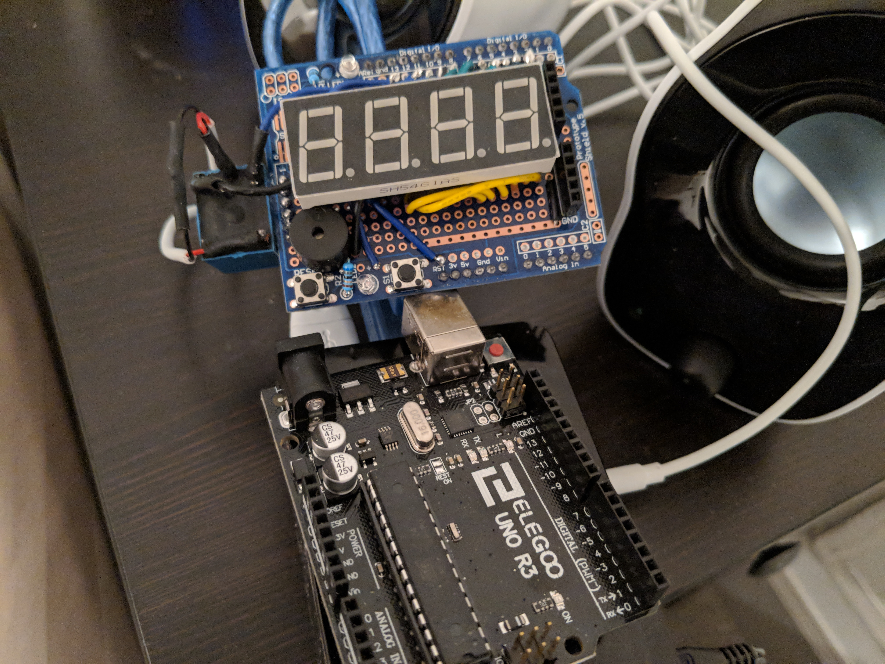
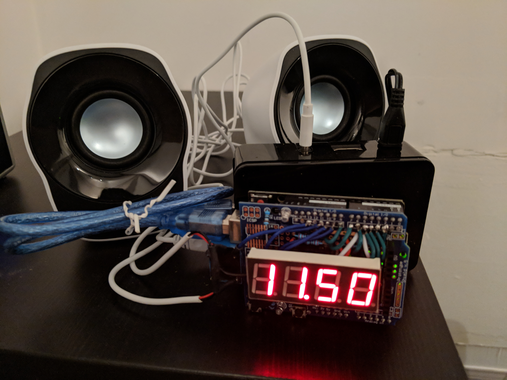

# AlarmClock

An alarm clock built using a Raspberry Pi and an Arduino. Some of its current features:

 * Clock display
 * Internet time
 * Alarm settings, using crontab
 * Snooze button
 * Sleep button
 * Streaming radio
 * Save alarms to local storage for reboots
 * Web interface to set alarms
 * Configure different sounds/lights/audio per alarm

Some future features being worked on:

 * Flashing LEDs: Knight Rider, flash, just on
 * Sounds: different tones, throbbing, klaxon
 * Configure different sounds/lights/audio per alarm
 * LEDs are hot swappable
 * Integrated case for Arduino

Here is what the wiring daigram looks like:

Here is what the prototype looked like on a breadboard:

Here is what it looks like on the expansion board:

Here is the expansion board next to the Arduino controller:

Here is the assembled final product:

* [AlarmClock](AlarmClock/) contains the code to deploy on the Arduino.
* [AlarmClockControl](AlarmClockControl/) contains the control script that runs on the Raspberry Pi.

For reference, these are the parts I used to build the device:

* [Elegoo EL-KIT-003 UNO Project Super Starter Kit with Tutorial for Arduino](http://a.co/is1QeRR)
* [CanaKit Raspberry Pi 3 Complete Starter Kit - Includes 32 GB Samsung EVO+](http://a.co/dgaqWof)
* [Logitech Stereo Speakers Z120, USB Powered](http://a.co/9sfc3Gj)

